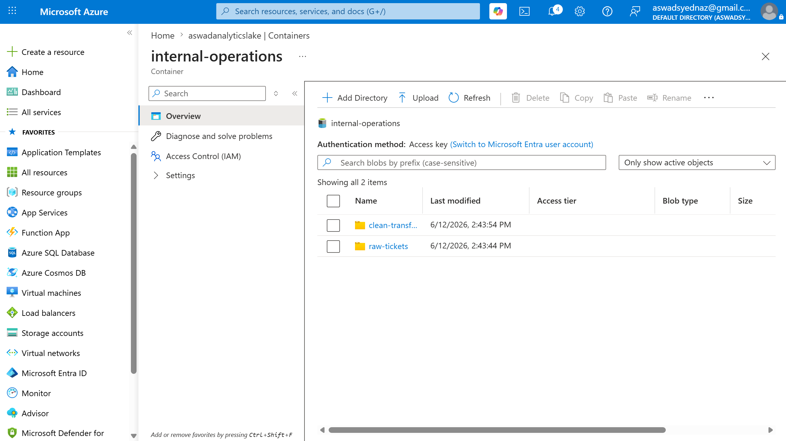
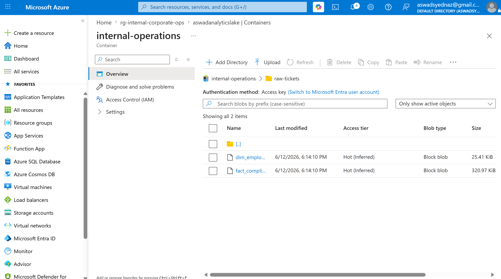
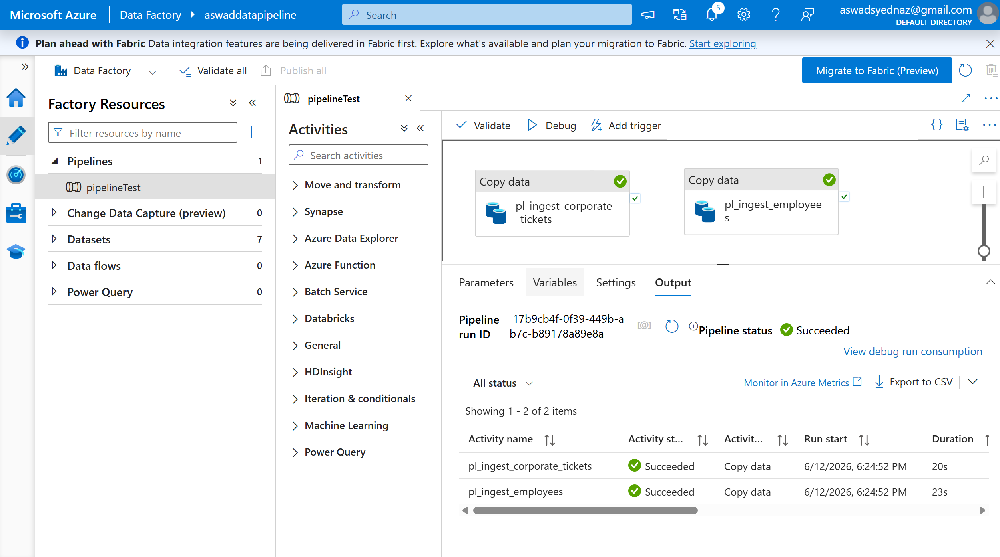
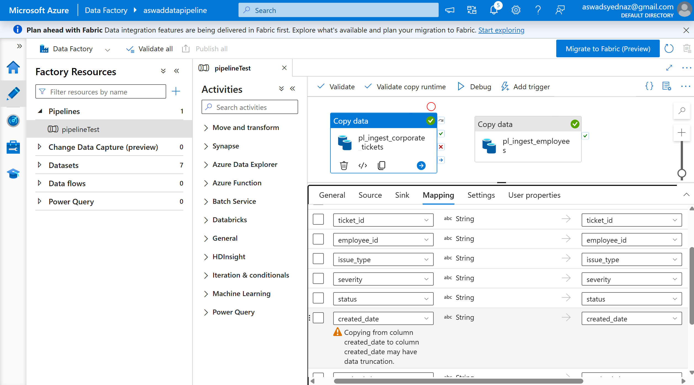

# Internal-services-operational-pipeline
An Internal Corporate Operations &amp; Legal Tech Pipeline. Instead of standard IT support, this tracks Internal Service Level Agreements (SLAs), Compliance Requests, and Legal Operations Tickets (such as internal contract reviews, data protection/GDPR requests, and corporate software provisioning).

In other words, just a simple business internal automation project for displaying Data in a Power Bi dashboard for further analysis , using Azure Data Lake as an environment to store the raw data, then ADF to filter it directly to a cloud based relational PostgreSQL database used to build the final dashboard.
The built dashboard is included in this project, view the image below: 

## 📌 Project Overview & Business Value

In modern enterprise operations, tracking internal compliance infractions (such as GDPR data breaches, insider trading alerts, and AML risks) requires rigid audit trails. Manual data gathering or loose desktop file tracking results in broken links, truncated strings, and reporting lag.

This project is a personal small practise for me,  by establishing a secure cloud data pipeline. A data simulation engine lands raw records directly into a cloud-native object store. From there, a serverless orchestration engine automatically aligns data structures, validates relational schemas, and pushes thousands of production-grade rows into a managed cloud database. This pipeline serves as a reliable, automated backend layer built specifically for executive business intelligence reporting. Finally, it connects the cloud-based database with a dynamic Power Bi dashboard.

---

## 🛠️ System Architecture

The core topology relies entirely on cloud-based infrastructure to handle heavy data scaling effortlessly:

1. **Data Generation:** Synthetic data simulation engine running natively inside the Azure Cloud environment.
2. **Landing Zone :** Azure Data Lake Storage (ADLS) Gen2 object storage container acting as a reliable raw files repository.
3. **Orchestration & Ingestion:** Serverless data movement pipelines engineered inside Azure Data Factory (ADF).
4. **Target Warehouse:** Managed database instance running Azure Database for PostgreSQL.

---

## ⚙️ Engineering Walkthrough & Cloud Implementation

### 1. Simulated Data Generation (Azure Cloud Shell)
Rather than executing extraction logic on a local machine, a custom data script (`generate_data.py`) was executed directly inside the **Azure Cloud Shell** bash terminal environment. 

To bypass global permission boundaries within the shared cloud terminal instance (`[Errno 13] Permission denied`), dependencies were safely isolated to the local user space using the `--user` flag:
```bash
pip install pandas faker --user

```

## 2. Data Lake Landing Zone (ADLS Gen2)
The raw output files are sent straight to an Azure Data Lake Gen2 container workspace. The storage folders are organized to separate incoming operational files from processing runs.

* **High-Level Container Storage Topology:** Demonstrates clean system segregation between internal business directories.
  

* **Raw Landing Folder Repository:** Displays the custom Python-generated files sitting securely inside the targeted directory, awaiting ingestion.
  

### 3. Serverless Orchestration Engine (Azure Data Factory)
Data ingestion is completely automated. Azure Data Factory manages the control flows, handling connections across storage boundaries while enforcing relational constraints.

* **Ingestion Pipelines Layout:** The `pl_ingest_corporate_tickets` orchestration canvas demonstrates independent copy data activities routing individual incoming source feeds.
  

* **Schema Alignment & Mapping Constraints:** Explicit data modeling rules ensure source string variables automatically convert to lowercase structured relational formats inside the PostgreSQL database without throwing errors.
  

### 4. Relational Data Warehouse (Azure Database for PostgreSQL)
The final sink for the corporate records is a cloud-hosted PostgreSQL database. 

