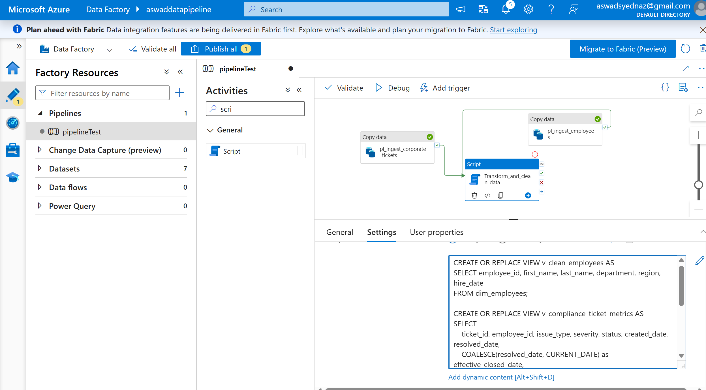
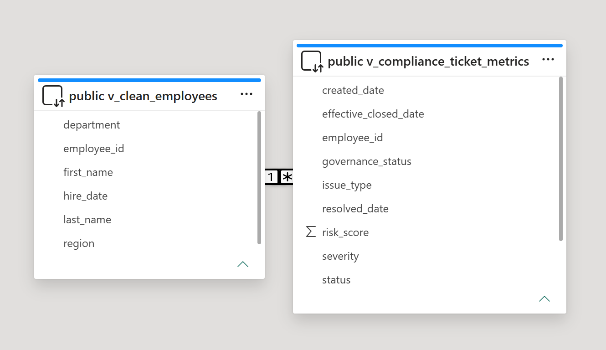
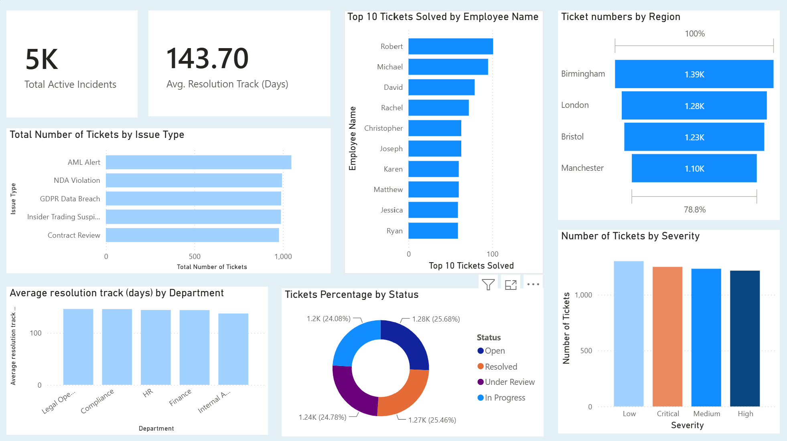

# Internal-services-operational-pipeline
An Internal Corporate Operations &amp; Legal Tech Pipeline. Instead of standard IT support, this tracks Internal Service Level Agreements (SLAs), Compliance Requests, and Legal Operations Tickets (such as internal contract reviews, data protection/GDPR requests, and corporate software provisioning).

In other words, just a simple business internal automation project for displaying Data in a Power Bi dashboard for further analysis , using Azure Data Lake as an environment to store the raw data, then ADF to filter it directly to a cloud based relational PostgreSQL database used to build the final dashboard.
The built dashboard is included in this project, view the image below: 

## Project Overview & Business Value

In modern enterprise operations, tracking internal compliance infractions (such as GDPR data breaches, insider trading alerts, and AML risks) requires rigid audit trails. Manual data gathering or loose desktop file tracking results in broken links, truncated strings, and reporting lag.

This project is a personal small practise for me,  by establishing a secure cloud data pipeline. A data simulation engine lands raw records directly into a cloud-native object store. From there, a serverless orchestration engine automatically aligns data structures, validates relational schemas, and pushes thousands of production-grade rows into a managed cloud database. This pipeline serves as a reliable, automated backend layer built specifically for executive business intelligence reporting. Finally, it connects the cloud-based database with a dynamic Power Bi dashboard.

---

## System Architecture

The core topology relies entirely on cloud-based infrastructure to handle heavy data scaling effortlessly:

1. **Data Generation:** Synthetic data simulation engine running natively inside the Azure Cloud environment.
2. **Landing Zone :** Azure Data Lake Storage (ADLS) Gen2 object storage container acting as a reliable raw files repository.
3. **Orchestration & Ingestion:** Serverless data movement pipelines engineered inside Azure Data Factory (ADF).
4. **Target Warehouse:** Managed database instance running Azure Database for PostgreSQL.

---

## Engineering Walkthrough & Cloud Implementation

### 1. Simulated Data Generation (Azure Cloud Shell)
Rather than executing extraction logic on a local machine, a custom data script (`generate_data.py`) was executed directly inside the **Azure Cloud Shell** bash terminal environment. 

To bypass global permission boundaries within the shared cloud terminal instance (`[Errno 13] Permission denied`), dependencies were safely isolated to the local user space using the `--user` flag:
```bash
pip install pandas faker --user

```

## 2. Data Lake Landing Zone (ADLS Gen2)
The raw output files are sent straight to an Azure Data Lake Gen2 container workspace. The storage folders are organized to separate incoming operational files from processing runs.

* **High-Level Container Storage Topology:** Demonstrates clean system segregation between internal business directories.
  

* **Raw Landing Folder Repository:** Displays the custom Python-generated files sitting securely inside the targeted directory, awaiting ingestion.
  

### 3. Serverless Orchestration Engine (Azure Data Factory)
Data ingestion is completely automated. Azure Data Factory manages the control flows, handling connections across storage boundaries while enforcing relational constraints.

* **Ingestion Pipelines Layout:** The `pl_ingest_corporate_tickets` orchestration canvas demonstrates independent copy data activities routing individual incoming source feeds.
  

* **Schema Alignment & Mapping Constraints:** Explicit data modeling rules ensure source string variables automatically convert to lowercase structured relational formats inside the PostgreSQL database without throwing errors.
  


### 4. Automated Data Transformation & Cleansing Layer (ELT Pattern)
Rather than relying on manual desktop tools like Excel or external SQL editors to clean the data after ingestion, the pipeline utilizes a true cloud-native ELT (Extract, Load, Transform) approach. 

A Data Factory **Script Activity** is sequenced to trigger automatically the exact second both copy routines successfully complete. This step executes a serverless SQL transformation script directly inside the database engine, cleaning raw fields and generating high-performance analytical database views (`v_clean_employees` and `v_compliance_ticket_metrics`) on the fly.

* **Automated Post-Load Cleansing Workflow:** Demonstrates the dependency chain where raw data is cleaned inside the cloud warehouse immediately upon landing.
  

Now the data inside the database in the cloud will store the cleaned data
---

## Final Phase: Live Power BI Dashboard Connect

With the data fully ingested, schema-validated, and automatically cleaned, the architecture completely decouples data processing from data presentation. 

By connecting Power BI Desktop directly to the secure cloud PostgreSQL database, reporting models bypass the raw base tables entirely. Instead, they ingest the pre-calculated, performance-optimized SQL Views (`v_clean_employees` and `v_compliance_ticket_metrics`). This structural design guarantees that the executive governance graphs render instantly and stay up-to-date automatically whenever the pipeline triggers.

## Business Intelligence Layer & Live Data Architecture

To serve enterprise stakeholders without degrading the core data engineering ingestion performance, this architecture isolates transformations from the data movement layer. Instead of executing heavy, permanent data cleaning scripts during ingestion, the system utilizes an optimized, server-side computing layout.

### Automated Cloud Pipeline & Virtual Storage Optimization

1. **Pipeline Execution Logic:** Upon the successful completion of the ingestion tasks inside the Azure Data Factory (ADF) pipeline, the control flow instantly triggers the connected SQL Script activity. This ensures backend data normalization executes immediately after raw tables are populated.
2. **Server-Side Virtual Tables:** The script deploys server-side `CREATE OR REPLACE VIEW` commands to build `v_clean_employees` and `v_compliance_ticket_metrics`. Because database views are virtual schemas, they contain zero physical data records and require **0MB of permanent database storage space**, acting purely as a saved query execution plan.
3. **On-Demand Data Transformation:** Power BI Desktop establishes a live pipeline to these SQL views utilizing **DirectQuery Mode**, maintaining zero local data footprint. The exact microsecond a stakeholder interacts with a visual component, Power BI passes an on-the-fly query down to the Azure Database for PostgreSQL engine. The database processes the view's logical rules—dynamically applying functions like `COALESCE` to eliminate nulls and calculating the age of compliance tickets in real time—before streaming the clean dataset back to the UI layout.

> **Deployment Note:** Due to Power BI cloud hosting governance requiring an active enterprise or organizational email domain to publish publicly, this report cannot be directly embedded. Please refer to the looping GIF at the top of the main repository page to see the dynamic cross-filtering features working

### Database View Relations Schema

Configuring structural relationships at the server catalog level allows the analytical environment to recognize schema integrity natively. This ensures that cross-filtering actions executed across disparate views sync uniformly across the data model.



### Core Executive Intelligence Brief

The final analytics canvas delivers multi-dimensional, native cross-filtering. Selecting a specific operational vulnerability, geographic region, or risk category dynamically recalibrates high-level KPI blocks and performance matrices in real time.


